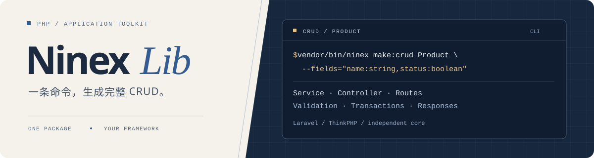

<div align="center">



<h3>
一个极简的 PHP 开发脚手架，一条命令生成 CRUD，统一集成分页、验证、事务、响应与异常处理。
</h3>

[](composer.json)
[](https://packagist.org/packages/ninex/lib)
[](LICENSE)

[快速开始](#快速开始) · [Laravel](#laravel) · [ThinkPHP](#thinkphp) · [兼容范围](#兼容范围) · [接入指南](docs/USAGE.md) · [更新记录](CHANGELOG.md)

</div>

---

## 快速开始

> 本页对应 **2.x**。1.x 用户请先阅读[迁移指南](docs/UPGRADE-2.md)；源码开发与分支试用见[开发说明](docs/DEVELOPMENT.md)。

安装到已有应用：

```bash
composer require ninex/lib:^2.0
```

### Laravel

```bash
php artisan ninexlib:make-crud Product --fields="name:string,status:boolean,note:text?"
php artisan migrate
```

配置自动合并，路由自动加载，生成后清理路由缓存。预览时加 `--dry-run`；已有 Sanctum 等认证可以通过 `--guard=sanctum` 指定。

生成模型、服务、控制器、迁移与路由。[Laravel 接入 →](docs/USAGE.md#laravel)

### ThinkPHP

```bash
php think ninexlib:make-crud Product --fields="name:string,status:boolean,note:text?"
```

生成服务、控制器、路由和 MySQL / SQLite 建表 SQL。执行对应 SQL，并由认证中间件提供可信的 `actor[id]`；生成接口已包含统一异常返回。[ThinkPHP 接入 →](docs/USAGE.md#thinkphp)

<details>
<summary><strong>独立命令与环境检查</strong></summary>

独立 CLI 自动识别宿主框架，也可以显式指定：

```bash
vendor/bin/ninex make:crud Product --framework=laravel --fields="name:string,status:boolean" --dry-run
vendor/bin/ninex doctor --strict
```

Laravel / ThinkPHP 原生入口分别为 `php artisan ninexlib:doctor`、`php think ninexlib:doctor`。
需要修改 Laravel 默认配置时，运行 `php artisan ninexlib:install`。

完整字段类型、生成选项和诊断说明见[接入指南](docs/USAGE.md)。

</details>

## 默认接口

以 Product 为例，Laravel 与 ThinkPHP 均提供以下接口：

| 方法 | 地址 | 操作 |
| :--- | :--- | :--- |
| `GET` | `/api/products` | 分页列表 |
| `GET` | `/api/products/{id}` | 详情 |
| `POST` | `/api/products` | 创建 |
| `PUT` | `/api/products/{id}` | 更新 |
| `DELETE` | `/api/products/{id}` | 删除 |

**生成的 CRUD 默认按用户隔离数据：接口通过项目已有的登录认证识别用户，每个人只能访问自己的记录。** 例如，用户 A 创建的数据，用户 B 无法查看、修改或删除。

登录功能由你的项目提供。公开查询、后台管理或团队共享等场景，需要按业务调整生成的路由和 Service；详见[认证与数据权限](docs/USAGE.md#权限与查询)。

## 业务代码保持简短

```php
$service->store(['name' => '键盘', 'status' => 0]);
$service->show($id);
$service->update($id, ['name' => '机械键盘']);
$service->destroy($id);
$service->paginate(['filter' => ['status' => 0], 'page_size' => 15]);
```

公共核心通过仓储接口接入数据库，使用数组与分页对象传递数据。生成器负责起步代码，应用决定自己的业务规则。

<details>
<summary><strong>统一响应与业务异常</strong></summary>

创建返回 HTTP `201`，成功响应保持一致：

```json
{
  "code": 0,
  "message": "操作成功",
  "data": { "id": 1, "name": "键盘", "status": 0 }
}
```

业务错误码与 HTTP 状态独立：

```php
throw new \Ninex\Lib\Core\ServiceException(
    '库存不足', 10001, ['available' => 0], httpStatus: 409,
);
```

分页、空值响应和旧协议开关见[响应说明](docs/USAGE.md#响应与异常)。

</details>

## 兼容范围

| 接入方式 | 最低 PHP | 集成范围 |
| :--- | :---: | :--- |
| 公共核心 / 独立 CLI | 8.1 | 无 Web 框架依赖；生成器需要 tokenizer |
| Laravel 10 | 8.1 | Eloquent、Artisan、自动发现 |
| Laravel 11 / 12 | 8.2 | Eloquent、Artisan、自动发现 |
| Laravel 13 | 8.3 | Eloquent、Artisan、自动发现 |
| ThinkPHP 8.1 | 8.1 | ThinkORM 3 / 4、原生命令、服务发现 |

约束为 `^8.1`，测试矩阵覆盖 PHP 8.1～8.4 的对应组合。兼容旧版本不代表上游仍在维护；生产环境应使用[受维护的 PHP 版本](https://www.php.net/supported-versions.php)。

旧 `LibModel` 保留 `guarded=['id']`，`validateForm` 仍可选，旧控制器不强制启用 Policy。HTTP 状态、空值与筛选行为等差异见[1.x → 2.x 迁移指南](docs/UPGRADE-2.md)。

---

**使用**　[接入指南](docs/USAGE.md) · [Laravel 示例](examples/laravel) · [ThinkPHP 示例](examples/thinkphp)<br>
**维护**　[架构](docs/ARCHITECTURE.md) · [开发测试](docs/DEVELOPMENT.md) · [发布流程](docs/RELEASING.md)<br>
**许可**　[MIT](LICENSE)
